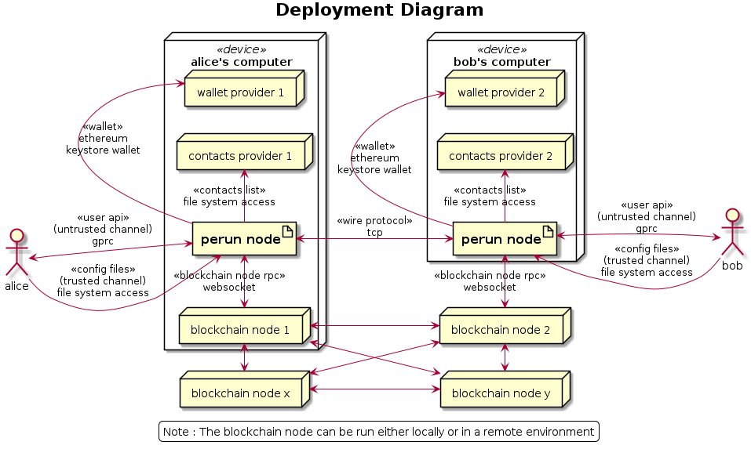

Design - Perun Node 
===================

Note: This is a running document and will be updated frequently during the
development process.

Perun node facilitates a user to open state channels, make off-chain
transactions on these channels and finally settle the balance on-chain.

In order to achieve this, the node provides the following interfaces:

Interfaces
----------

1. User API - Provides the user a comprehensive set of APIs to open, use and
   settle state channels. This is an untrusted channel and hence no secrets
   (such as private keys, passwords etc.,) should be sent on this channel. The
   first implementation (v0.3.0) will implement User API using gRPC protocol.

2. Config files - Provides the user a set of templates to provide data for
   configuring the node and secrets such as password, private keys. This is a
   trusted channel and hence can be used for sharing secrets with the node.
   There are two config files: node config file and session config file, that
   is used during initialization of the node and the session respectively. The
   first implementation (v0.3.0) will require the user to place the
   configuration files on the file system that is accessible by the node and
   provide the path to the files via user API.

3. Contacts List - Facilitates the user to provide a list of trusted contacts
   the user want to transact with. While the off-chain address (a cryptographic
   address) is used to uniquely identify each peer in the network, the contacts
   list enable the user to specify a friendly alias for each peer in the
   contact list. This alias should be unique within the contact list and the
   user can use the alias to reference a particular peer in the user API calls.
   The first implementation (v0.3.0) will require the user to provide list of
   all contacts in a yaml file. This list cannot be updated in runtime.

4. Wallet - Facilitates the user to safely store secret keys and use them to
   make signatures. The first implementation (v0.3.0) will use keystore
   wallets.  This requires the user to place the keystore directory on the file
   system accessible by the user and provide the path, addresses and passwords
   via config files.

5. Wire protocol - Facilitates communication between different perun nodes. The
   protocol itself is implemented in the SDK (`go-perun`) and will be
   automatically handled by the node whenever a specific operations (channel
   open, new incoming state update, new outgoing state update, settle etc.,) is
   done on the channel. The node however implements the transport protocol
   adapters for the wire protocol. The first implementation (v0.3.0) will
   implement a simple tcp adapter.

6. Blockchain node RPC - Facilitates communication between the perun node and
   the blockchain network for reading on-chain data and making on-chain
   transactions. The RPC adapter itself is implemented in the SDK (`go-perun`)
   and will be automatically handled by the node whenever an on-chain
   interaction is required. In addition to that, the node provides the user to
   a mechanism to read the on-chain balance for the funding account of the
   user. The current implementation of the adapter supports only JSON RPC
   interaction over websockets with an ethereum geth node. The first
   implementation (v0.3.0) will require the user to provide the URL of a
   running geth instance, that has websocket protocol enabled.

The deployment diagram shows all of the interfaces described above.



Using the node
--------------

1. Start the node: Provide the node config file. The node currently has no open
   sessions.
   
2. Request a session: Provide contacts list, keystore files and session config
   files. Once the session is established, user can access it using the session
   ID via user API.
   
3. Propose a channel or Wait for incoming channel proposal. Funds are blocked
   in the channel, once the proposal is accepted by all the parties.
   
4. Make any number of off-chain transactions on the channel.
   
5. If the peer registers an older state, node posts a challenge with the latest
   valid state automatically (No user action is required).
   
6. If all off-chain transactions are complete, close the channel. Channel funds
   are returned to on-chain accounts.

Implementation Tasks
--------------------

Week 31 (Current)
`````````````````

1. Contacts provider (Milestone 7)
2. Keystore wallet (Milestone 7)
3. Config files (Milestone 5)

Week 32
```````

4. User API (Milestone 8)

   a. Descriptive specifications
   b. Protocol specifications
   c. Abstract API layer implementation
   d. Protocol specific API layer implementation

First half of Week 33
`````````````````````

5. Integration (Milestone 9) 

   a. New Session (Init contacts, off-chain comm, wallet, blockchain node rpc).
   b. Propose & Accept / Decline New Channel.
   c. Propose & Accept / Decline New State.
   d. Closing a channel.

Release v0.3.0: End of Week 33 (with a safe buffer of 2 days) 14.08.2020 Friday

